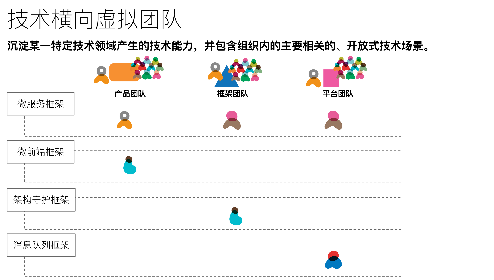
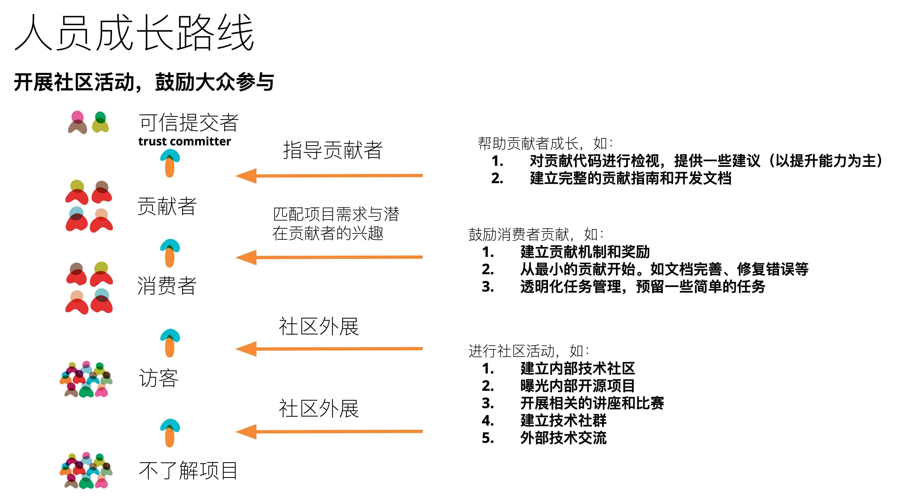
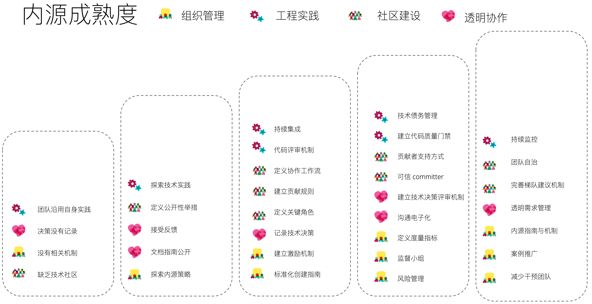

# 内源

## “内源” vs 中台

> 内源即将开源方法（最佳实践、协作方式、架构模式等）融入到组织的软件构建和发布方式之中，以在组织内构建类似开源的文化。

作为一个站在国内开源前线的开发者（GitHub 国内 Top 10），我本应该早点写一篇关于：『为什么应该选择内源，而非中台？』。然而呢，中台一直在火，找不到合适的机会。直到最近，因为拆中台，所以它又火了。我觉得再不聊聊，下一个热点技术领域又要出现了。

对于大部分不了解开源的人来说，他们很难理解：为什么“内源”能解决中台没有解决的问题？内源不就是在内部建立起开源式的项目，它哪能比中台更好？

### 为什么是“内源”优于中台？

#### 中台背景下的复用

对于中台的定义，大家都很了解了：企业级能力复用平台，又或者是，各类的复用、聚合、协调。它从组织的层面定义了，内部的各个系统及其如何协作。中台做了一个非常优秀的事情：定义了企业 IT 架构的标准化梳理形式。即，我们可以以一套方法论来自上而下梳理企业架构。

然而，从软件开发的角度来看，它违背了一些软件设计的思想：

 - 复制优于复用。即追求复用会加深系统间的耦合度。在系统重构时，一种常见解决方式就是复制，在开源世界里就是：方向不同，即可在其基础上另起炉灶（fork）。
 - 组合优于继承。即通过多个组件、服务的组件构建系统，而不是将大量不同的逻辑加入到同一个系统中。

对于大量相似业务的公司来说，它能产生巨大的价值。但是，多数公司并不存在这样的场景。它只会带来系统间的耦合度，进一步挺慢企业创新 + 产品上市的速度。除此之外，它并没有帮助企业解决一系列的内在问题，譬如部门之间的协作、降低系统的耦合度、复用的整体机制等等。那么，问题来了，如何实现解耦与复用的平衡呢？

#### 系统的解耦与复用

回到架构设计领域的『整洁架构』，对于解耦模式来说，通常有这么一些层级（源自《整洁架构之道 》）：

1. 源码层次。控制源码代码模块之间的依赖关系（如 Maven 中的依赖），来实现一个模块的变更，以避免影响到其它模块。
2. 部署层次。控制部署单元（如 jar 文件）之间的依赖关系，以避免因为单个模块的变更，影响到系统中的其它模块。
3. 服务层次。将组件间的依赖关系降低到数据结构，然后仅通过网络数据来进行通信。

对应到了系统的各个部分：业务/产品/系统的应用、微服务、软件包。为了复用它们，常见的方式就是拆模块、封装组件、封装服务等等。

在团队内部，最常见的方式就是模块 + 组件复用，而跨团队的模块复用，则是服务的复用。模块 + 组件复用，除了经常引入非公共的公共代码，基本上没有啥问题。而模块的复用呢，则是各种矛盾的中心：A 团队提供服务给其它团队，其它团队经常报怨 A 团队响应太慢，而 A 团队也不愿意向其它团队提供服务 —— 容易被打乱节奏。

还有关于投入人力以复用时，常常忽略的一点是：付给程序员的工资，远比 CPU + 内存贵多了。

#### 源码 -> 协作 -> 社区 -> 文化

既然，你想通过我们已经实现的功能，来帮助你快速构建你的系统，而我也不想配合你修改我们的系统。那么，我们就从最简单的一种方式开始，你**复制**一份我们的代码，各走各的路。如果你不愿意复制，又想让我们提供支持，那么请为这个系统提供**人力支持**。

开放源码，促成两个团队的协作，这就是『内源』的雏形。不满意，你就 fork 项目，自己维护自己的版本；符合需要，我们可以一起合作，完善这个项目。

根据这个基本的思想，我们可以发现一个组织内有大量的代码可以开源共享：

 - 特定场景下的业务。比如金融场景下，对于内部交易系统的封装（主机）。
 - 技术型服务。
 - 基础设施。如微服务基础设施、前端组件等。
 - ……

而围绕这些不同的业务、技术、框架、场景等，就能构建出基于这些领域的知识性社区，幸运的话可以直接诞生出生机型组织。

## 内源解决了什么？

让我们将内源带来的收益，映射到《企业 IT 架构转型之道 ：阿里巴巴中台战略思想与架构实践》一书所提及的『烟囱式』系统三大弊端：

1. 重复功能建设和维护带来的重复投资。
2. 打通『烟囱式』系统间交互的集成和协作成本高昂。
3. 不利于业务的沉淀和持续发展。

从理论上来看，中台解决了问题。回过头来看：内源是不是也解决了这些问题？ 并且，由于内源不是一种集中式建设，而是自下而上的发起，加自上而下的激励，所以它反而还能真正为组织带来活力：

 - 技术实践传播。如编码、测试、持续集成实践等等。
 - 跨团队的技术交流。
 - 构建生机型文化组织。

当然，这些都不是一件容易的事。

## “内源”的优势

从我个的观点来看，内源主要有这么一些优势：

1. 为**创新**赋能。它可以为为想法创建桥梁，加快产品的上市速度。
2. 促进跨部门**协作**。跨团队进行合作、应用级信息互通，构建生机型文化、
3. 有效的**知识管理**。通过代码传播最佳技术实践，促成更好地文档形式。
4. 潜移默化提升**质量**。测试提升项目可信度，并有意识提升测试密度。
5. 加速**开发**。学习现有应用减少探索成本，通过复用降低开发成本。
6. 无负担**重用**。提供方和使用方各自独立，降低提供方的心智负担。

而从个人的角度来看，**无负担重用**将会是国内企业采用内源一个重要原因。其次，则是**协作**，我看好它带来的一个重要原因是：横向虚拟团队 + 内部技术社区。但是，不可置否能否真正成立横向虚拟团队，依赖于组织的负责人。

### 横向虚拟团队

作为一个技术人，我觉得每家有一定规模 IT 人员的公司应该有横向虚拟团队。它可以沉淀某一特定技术领域产生的技术能力，并包含组织内的主要相关的、开放式技术场景。

大型 IT 组织里，在不同的领域都会不断提炼出技术框架，并沉淀下去。最常见的示例就是互联网公司的开源，它们会选择将一些沉淀的基础设施开源出去，以吸纳更多的相关领域人才，进一步提升该组织在该领域的能力 —— 如阿里巴巴的云原生开源。

相似的，以内部开源的方式，可以将特定领域的人才聚集起来，强化组织在这一方面的能力，并进一步提升其他/她开发人员的能力。如一个以微服务框架构建内部技术群，围绕的是该微服务框架的演进，以及如何适用于不同团队的落地。通过一系列的讨论 + 编码 + 示例，能加速产品的开发和实施，以及这个内源项目的完善。

## 如何“内源”？

考虑到“内源”本身也是类似于中台、敏捷这样的组织转型，它与它们的方式实现上是差不多的。

0. 内源办公室。同样的，它也是一个虚拟的组织。
1. 理念宣讲。即在公司内部发起“内源”相关的姿势。
2. 选择试点团队。选择合适的团队，来试点运营，快速验证在组织内的方向。
3. 建立标杆团队。
4. 内部社区运营。
5. 推广实践。

然而，与中台、敏捷这一类的转型方式不太一样的是，“内源”与开源方式类似，在单个项目上它依赖于『**受信任的个人**』，这也是开源项目与企业内部软件开源非常不同的一点。所以，与之相匹配的是，在“内源”运动里，单个项目非常需要**可信提交者**（Trust Committer）。可以暂且认为是在内部有技术影响力，并且还在**编码**的个人。

### 可信提交者

**可信提交者**（Trust Committer），即有直接向代码仓库提交的开发人员。即，你是经专业开发人员论证的有能力的开发者，可以一起为这个项目做贡献。从一个外部开源人员，到能直接向内部代码库提交代码并不是一件容易的事情，需要一步步的成长过来。

如在引入 Committer 机制的华为公司里 （源自《[如何构建高效可信的持续交付能力，华为云有绝活！](https://segmentfault.com/a/1190000039022281)》，Committer 要做这么一些事情：

 - 代码的开发、提交与合入权限应要分离，以避免攻击者冒用员工权限植入恶意代码；
 - 通过检视和审核的意见对工程师进行辅导提升团队软件能力。
 - 入库审核还能反向驱动前端代码检视提升，促进 Developer 具备编写 Clean Code 的能力。

而这个流程是自己的项目上都采用了相关的流程。

## 为什么“内源”很难？

『内源』在国内比较痛苦的一点是：内源需要自上而下的推动。至于要多上呢，这又是一个值得沉思的问题 —— 当然是越上越好。哪怕是有了组织的支持，还需要一系列的改变：

 - 建立组织的分享 + 开放的文化。
 - 构建生机型文化不易。
 - 透明 + 开放式的项目管理机制（只针对于内源）。
 - 让开发人员跨团队开发
 - 与能力相配套的技术实践

除此，从某种意义上来说，『内源』在国内又不是一个特别好的词语，听上去就是一个技术词汇，笑 ~ 。
